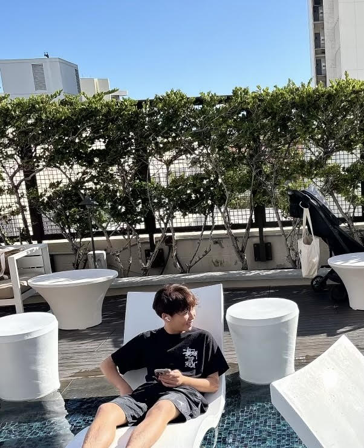
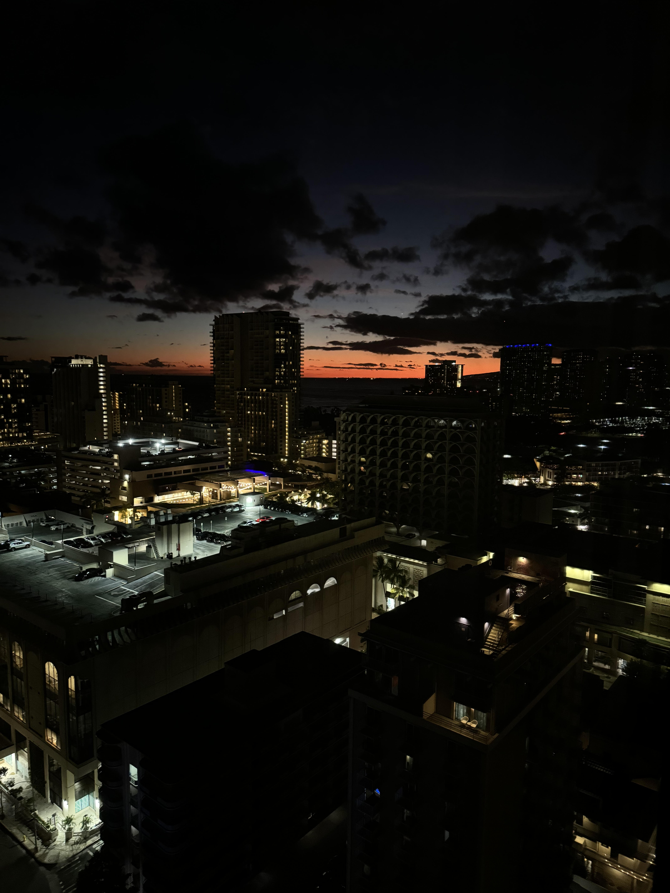
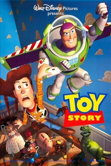
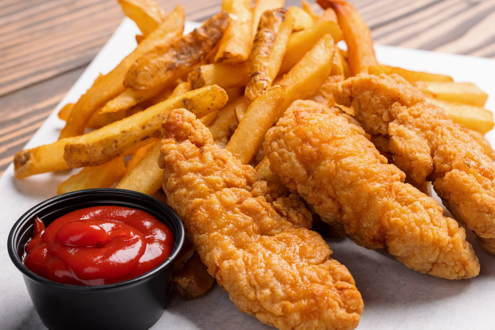

# **Jaden Park Period 1**

## Introduction
- Name: Jaden Park
- Grade: 10th
- Basic Info: I love to run, listen to music, and go hiking!

## Summer Activities
1. I went to Seattle in June 

2. I went to Hawaii in July

## Favorite Movie
Ever since I was a kid, I used to love the movie, "Toy Story". 

I love this movie because I really loved the characters and how they evolved over the course of time as well as how they communicated with Andy, the boy who owns these toys. 

[Click on this link to view more about "Toy Story."](https://en.wikipedia.org/wiki/Toy_Story)

## Favorite Summer Food
During the summer, my favorite food would most definitely be chicken tenders with fries!

## Learning Experiences
During July of this year, I took an online course for Spanish 3. Although it was an excruciating class, I was able to finish it off strong and pass the course with an A. 

